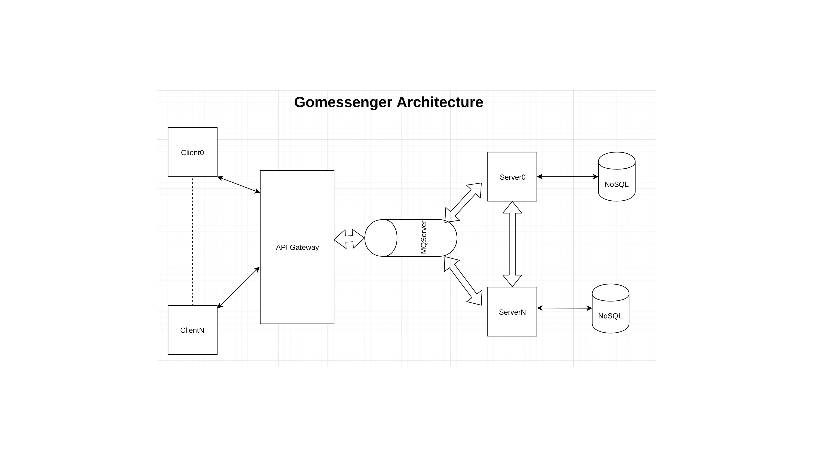

# gomessenger (UNDER DEVELOPMENT)
Simple chat software to send/receive a messages+download/upload big files.
It uses:
1. ReactJS as frontend
2. Golang as backend
3. NoSQL(HBase) to store the data
To upload/Download files, it will use peer to peer connection with notification to a Server

#TODOs:
1. Add Unit test cases
2. A bit more documentation

